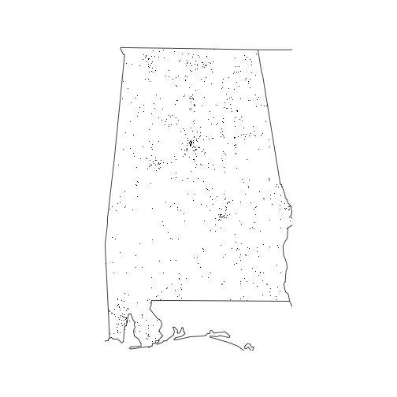

This package is designed to read csv files about accident data. Overall, the package has 2 main functions:

- `fars_summarize_years()` gives a 12-by-n table as the output, which summarizes the accident data of specific years into months
- `fars_map_state()` gives a map with marks as the output, which graphs the accident data of specified year and state onto the state map

## Functions

There are a total of 5 functions in this package and they are all written in the same R file called `far_functions.R`. Below you can find a brief description of each function:

### `fars_read(filename)`

This is a simple function that takes the file name string as parameter. If there exists such file, the function will read the file `readr::read_csv` and save the data in the file as a dataframe with `dplyr::tbl_df`. If the file name does not exist, the function will return an error stating that such file does not
exist with `stop()`.

#### Parameters

- filename: the filename (under current working directory) of the file interested

### `make_filename(year)`

This is a function that takes the year as input. After turning it from a string into an integer with `as.integer()`, it prints out a file name in the form of "accident_n.csv.bz2",where n will be the year the user puts in. Notice that for this function, you could either input a string or an array of numbers and it will give you an array of file names made as well.

#### Parameters

- year: A single year of which the data that is interested. 

### `fars_read_years(years)`

This is a function that takes a vector of years as input. For each element in the vector, first, it makes the file name with the given year (using the `make_filename()` function mentioned above). Then it tries to read the data using `fars_read()` function and `dat` argument. For the data in the file, the function will select the 'month' variable of the elements where variable 'year' is equal to the current element in the years vector (with the `tryCatch()` function). If this process fails at any stage, it will return an error stating that the year is invalid. This process is to repeated for every element in the input vector.

#### Parameters

- years: An array of or a single year of which the data that is interested. 

### `fars_summarize_years(years)`

This function will take a vector of years as input. First, it reads through the files of given years and save the months and years data into a list using `fars_read_years()` function mentioned above. Then it turns the large list into a dataframe (with `dplyr::bind_rows()` function). After that, it groups the dataframe by month and year (using `dplyr::group_by()` function). Then, each group is summarized as the number of elements for each specific month in each year (using `dplyr::summarize()` function. In the end, to tidy up the output, this summary is displayed such that month is the element name and years are the variables spreading out (using `tidyr::spread()` function). The final result gives a 12-by-n table as the output, which summarizes the accident data of specific years into months

#### Parameters

- years: An array of or a single year of which the data that is interested. 

### `fars_map_state(state.num,year)`

This function turns accident data of specified year and state into map. It asks for state number and year from the user as inputs. It first makes the file name (using `make_filename()` function) and reads in the data from the file name (using `fars_read()` function). Then it ensure that the input state number is an integer (with `as.integer()` function). Then the function checks if the input state number is in the data. If it is in the data, the function will proceed to filter the data where only the observations that match for the given state number are selected. After that, the function will check if there are accidents happened in that states. If there are actually accidents, the function will start to map the accidents. First, it rules out any outlier in the selected data (with `is.na()` function). After all the cleaning and summarizing data, fhe function finally maps out the accidents as points representing their position in the states (using `maps::map()` `graphics::points()` functions).

#### Parameters
- state.num: the state number recorded in in the data given. If no match appears,the function will return an error

- year: the year of data wanted. 

## Example

Now a simple example is demostrated with a file named "accident_2015.csv.bz2".


First, we can implement the `fars_summarize_years()` function:


```r
fars_summarize_years(2015)
```

```
## # A tibble: 12 x 2
##    MONTH `2015`
##  * <int>  <int>
##  1     1   2368
##  2     2   1968
##  3     3   2385
##  4     4   2430
##  5     5   2847
##  6     6   2765
##  7     7   2998
##  8     8   3016
##  9     9   2865
## 10    10   3019
## 11    11   2724
## 12    12   2781
```

In this function, '2015' is first passed into `make_filename()` to make a file name "accident_2015.csv.bz2". Then `fars_read()` would take the file name and read the data from that file. After that, `fars_read_years()` extracted the data about year and months from the data. These 3 functions are implemented inside of `fars_summarize_years()` so we don't need to call them separately. In the end, the filtered data is summarized into the output we see above. 

Now we will show another example of using `fars_map_state()`:


```r
fars_map_state(1,2015)
```




In this function, "2015" is passed into `make_filename()` to make a file name so that `fars_read()` could read the data of the file, just like the previous function. After that, the function will extract all the data with the specified state number can plot the graph on the state map, as shown above.

